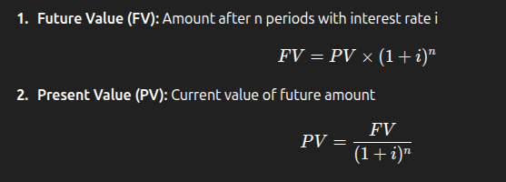
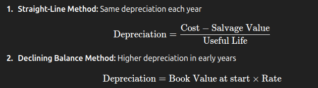
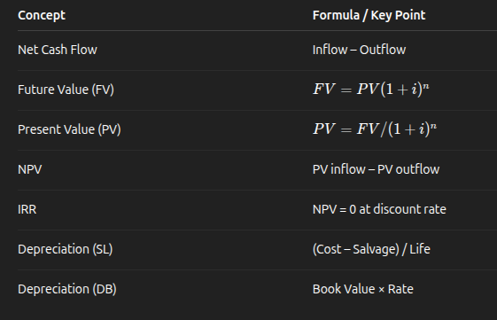

## **10.2 Engineering Economics**

### **1. Project Cash Flow**

- **Definition:** Cash flow is the **movement of money in and out** of a project over time.
- **Net Cash Flow:**
  [
  Net Cash Flow = Cash Inflow - Cash Outflow
  ]
- **Cash Inflow:** Revenue, grants, savings.
- **Cash Outflow:** Costs of construction, operation, maintenance.

**Key Point:** Always consider the **timing** of inflows and outflows.

---

### **2. Time Value of Money (TVM)**

- **Principle:** Money today is **worth more** than the same amount in the future.
- **Formulas:**

Where:

- PV = Present Value
- FV = Future Value
- i = Interest rate per period
- n = Number of periods

**Key Point:** Higher interest rate or longer time → bigger difference between PV and FV.

---

### **3. Basic Economic Analysis Methods**

1. **Discounted Payback Period**

- Time to recover the initial investment considering **time value of money**.
- Shorter payback → more attractive project.

2. **Net Present Value (NPV)**

   

- Positive NPV → project acceptable
- Negative NPV → project rejected

3. **Internal Rate of Return (IRR)**

- Discount rate where **NPV = 0**
- Project accepted if **IRR > MARR**

4. **Minimum Attractive Rate of Return (MARR)**

- Minimum return required by investors to accept a project.

**Key Points:**

- NPV: absolute profitability
- IRR: rate of return
- MARR: benchmark

---

### **4. Comparison of Alternatives**

- Use **NPV, IRR, or Benefit/Cost Ratio**
- Rule: Choose alternative with **highest NPV** or **IRR > MARR**

---

### **5. Depreciation Systems**

- **Purpose:** Allocate cost of asset over its useful life.

**MCQ Tip:** Usually they ask **definition or difference between SL and DB**.

---

### **6. Taxation System in Nepal**

- **Corporate Tax:** On profits of company
- **Income Tax:** On individuals or entities
- **VAT:** On goods/services
- Affects **cash flow, NPV, and feasibility** of projects

**MCQ Tip:** Questions may ask **types of taxes affecting projects**.

---

## **Summary**

---

### **MCQs – Engineering Economics**

1. **Which of the following is the net cash flow?** 
   A) Cash inflow only 
   B) Cash outflow only 
   C) Inflow – Outflow 
   D) Inflow + Outflow

   **Answer:** C) Inflow – Outflow

   ***

2. **The principle of time value of money means:** 
   A) Money now = Money later 
   B) Money now < Money later 
   C) Money now > Money later 
   D) Money later has no value

   **Answer:** C) Money now > Money later

   ***

3. **Which method shows the time required to recover investment considering interest?** 
   A) NPV 
   B) Discounted Payback Period 
   C) IRR 
   D) MARR

   **Answer:** B) Discounted Payback Period

   ***

4. **A project is acceptable if NPV is:** 
   A) Positive 
   B) Zero 
   C) Negative 
   D) Less than initial investment

   **Answer:** A) Positive

   ***

5. **Depreciation method that charges same amount every year:** 
   A) Declining Balance 
   B) Straight-Line 
   C) Sum-of-Years-Digits 
   D) None

   **Answer:** B) Straight-Line

   ***

6. **IRR is:** 
   A) Discount rate where PV = 0 
   B) Discount rate where NPV = 0 
   C) Minimum rate required 
   D) None of these

   **Answer:** B) Discount rate where NPV = 0

   ***

7. **Which tax is applied on goods and services in Nepal?** 
   A) Corporate Tax 
   B) Income Tax 
   C) VAT 
   D) Customs Duty

   **Answer:** C) VAT

   ***

8. **If IRR > MARR, the project is:** 
   A) Acceptable 
   B) Rejected 
   C) Neutral 
   D) None

   **Answer:** A) Acceptable

   ***

9. **Present Value of Rs. 1000 after 2 years at 10% interest:** 
   A) 1200 
   B) 1000 
   C) 826.45 
   D) 900

   **Answer:** C) 826.45 (PV = 1000 / 1.1² ≈ 826.45)

   ***

10. **Which method of depreciation has higher expense in early years?** 
    A) Straight-Line 
    B) Declining Balance 
    C) Both same 
    D) None

    **Answer:** B) Declining Balance
