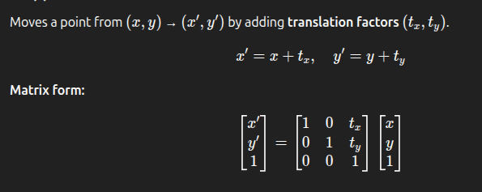
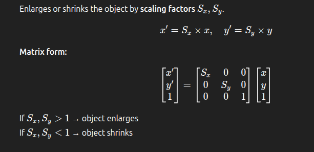
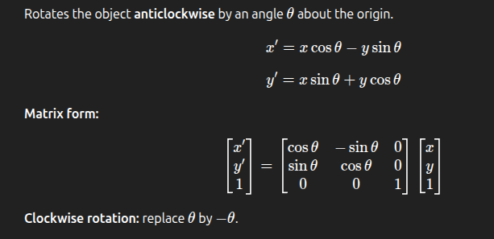
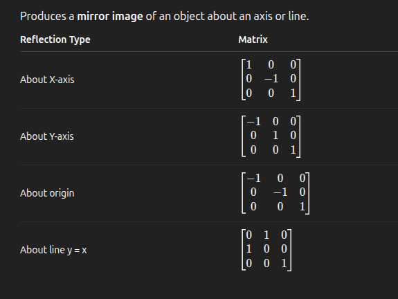
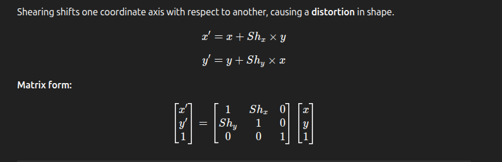

### **_Section 6.5 Two-Dimensional Transformations_**

---

### 1. What is a Transformation?

A **transformation** in computer graphics means **changing the position, size, or orientation** of an object in a 2D or 3D space.

Mathematically, a transformation modifies the **coordinates** of points.

If a point is ( P(x, y) ), after applying a transformation it becomes ( P'(x', y') ).

---

### 2. Basic 2D Transformations

There are **five** basic 2D transformations:

| Transformation  | Effect                                        |
| --------------- | --------------------------------------------- |
| **Translation** | Moves object from one place to another        |
| **Scaling**     | Enlarges or shrinks the object                |
| **Rotation**    | Rotates object about a point (usually origin) |
| **Reflection**  | Flips object about a line or axis             |
| **Shear**       | Distorts object shape along X or Y direction  |

---

### (a) **Translation**

---

### (b) **Scaling**

---

### (c) **Rotation**

---

### (d) **Reflection**

---

### (e) **Shear Transformation**

---

### 3. Composite Transformations

When multiple transformations are applied **sequentially**, we can **combine** them into a single transformation matrix by **multiplying** individual matrices.

Example:
To rotate first and then translate 
( M = T \* R ) (multiply in **reverse order** of application)

**Rule:**
If transformations are ( A, B, C ) applied in sequence 
then total = ( M = C \times B \times A ).

---

### 4. 2D Viewing Pipeline

The **2D viewing pipeline** is the sequence of steps used to display 2D scenes.

| Step                           | Description                                     |
| ------------------------------ | ----------------------------------------------- |
| **1. World Coordinate System** | Defines positions of all objects in world space |
| **2. Windowing**               | Selects portion of the world to display         |
| **3. Viewport Mapping**        | Maps window to screen coordinates               |
| **4. Clipping**                | Removes objects outside the view                |
| **5. Display**                 | Final image is drawn on screen                  |

---

### 5. World-to-Screen Viewing Transformation

Converts **world coordinates** (actual scene positions) to **device coordinates** (pixels on screen).

---

### 6. Clipping

Clipping means **cutting** portions of objects that lie **outside the display area**.

---

#### (a) **Cohen–Sutherland Line Clipping Algorithm**

- Used to clip **lines** to a rectangular window.
- Divides the region into **9 zones** using **region codes** (4-bit code: TOP, BOTTOM, RIGHT, LEFT).
- Steps:

  1. Compute region code for each endpoint.
  2. If both codes = 0000 → completely inside (accept).
  3. If logical AND ≠ 0000 → completely outside (reject).
  4. Else → partially inside → clip intersection points.

---

#### (b) **Liang–Barsky Line Clipping Algorithm**

- Based on **parametric equations** of the line.
- More **efficient** than Cohen–Sutherland (fewer comparisons).
- Uses inequalities: for ( 0 <= u <= 1 )

  **_x = x1 + u(x2 - x1)_**
   

  **_y = y1 + u(y2 - y1)_**

---

### Summary Table

---

### 10 Quick MCQs (with Answers)

1. **Which transformation changes the size of an object?** 
   a) Rotation 
   b) Scaling ✅ 
   c) Translation 
   d) Reflection 

2. **Which transformation moves an object from one position to another?** 
   a) Translation ✅ 
   b) Rotation 
   c) Shear 
   d) Reflection 

3. **Rotation about the origin by 90° anticlockwise transforms (x, y) to:** 
   a) (y, -x) 
   b) (-y, x) ✅ 
   c) (-x, -y) 
   d) (x, y) 

4. **Shear transformation affects:** 
   a) Shape ✅ 
   b) Size 
   c) Color 
   d) Orientation 

5. **Reflection about X-axis makes (x, y) →** 
   a) (y, x) 
   b) (-x, y) 
   c) (x, -y) ✅ 
   d) (-x, -y) 

6. **The product of two transformation matrices represents:** 
   a) Subtraction of transformations 
   b) Composite transformation ✅ 
   c) Division of transformations 
   d) None 

7. **Cohen–Sutherland algorithm is used for:** 
   a) Line clipping ✅ 
   b) Polygon filling 
   c) Curve generation 
   d) Scaling 

8. **Which is faster for line clipping?** 
   a) Cohen–Sutherland 
   b) Liang–Barsky ✅ 
   c) Midpoint 
   d) Bresenham 

9. **In reflection about line y = x, (x, y) becomes:** 
   a) (x, y) 
   b) (-x, -y) 
   c) (y, x) ✅ 
   d) (x, -y) 

10. **The process of cutting objects outside the viewport is called:** 
    a) Scaling 
    b) Shearing 
    c) Clipping ✅ 
    d) Mapping 
