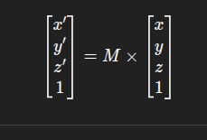
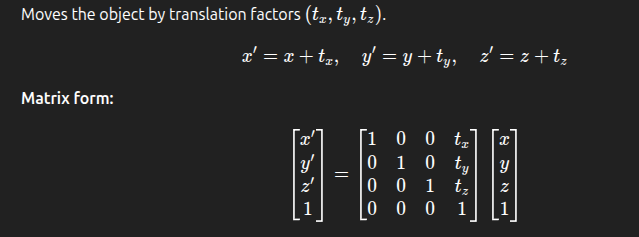
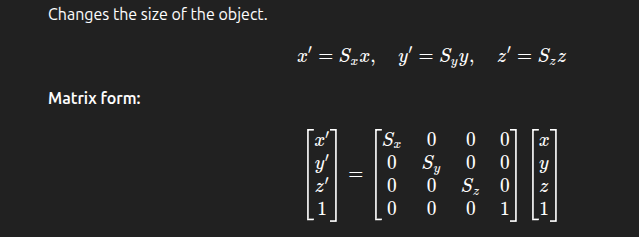
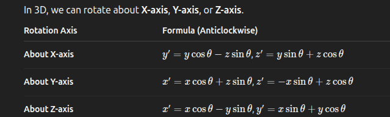
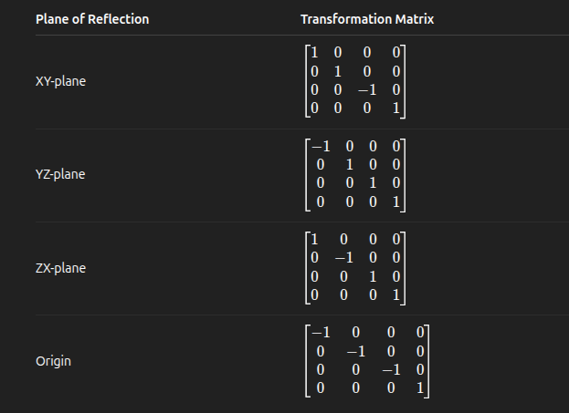
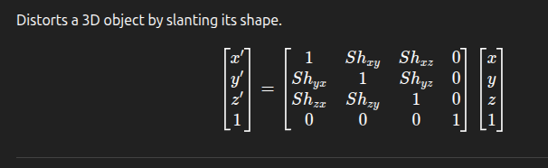
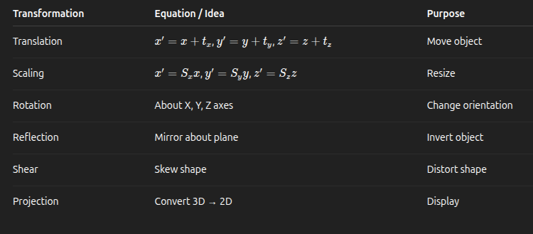

### **_Section 6.6 — Three-Dimensional Transformations_**

---

## 1. What is 3D Transformation?

A **3D transformation** changes the position, size, orientation, or shape of a 3D object.

- A point in 3D space is represented as **P(x, y, z)**.
- After transformation, it becomes **P′(x′, y′, z′)**.
- Homogeneous coordinate representation (for matrix form):
  

---

## 2. Basic 3D Transformations

| Transformation  | Effect                             |
| --------------- | ---------------------------------- |
| **Translation** | Moves object in 3D space           |
| **Scaling**     | Changes size of object             |
| **Rotation**    | Rotates object about an axis       |
| **Reflection**  | Creates mirror image about a plane |
| **Shear**       | Distorts object shape              |

---

### (a) **Translation**

---

### (b) **Scaling**

---

### (c) **Rotation**

**Example:**

- Rotation about X-axis → affects **Y and Z**
- Rotation about Y-axis → affects **X and Z**
- Rotation about Z-axis → affects **X and Y**

---

### (d) **Reflection**

Mirror image about a coordinate plane or the origin.

---

### (e) **Shear**

---

### 3. Composite 3D Transformations

When several transformations are applied in sequence, we multiply their matrices.

Example: Rotate → Scale → Translate
Total = ( M = T x S x R )

**Remember:** Multiplication order matters (rightmost applied first).

---

## 4. 3D Viewing Pipeline

The **3D viewing pipeline** converts objects from 3D world space to 2D screen display.

| Step                           | Description                                   |
| ------------------------------ | --------------------------------------------- |
| **1. Modeling Transformation** | Places individual object in world coordinates |
| **2. Viewing Transformation**  | Defines camera/view orientation               |
| **3. Projection**              | Maps 3D objects onto 2D view plane            |
| **4. Clipping**                | Removes objects outside the view volume       |
| **5. Viewport Transformation** | Maps final image to screen coordinates        |

---

## 5. Projection Concepts

**Projection** converts 3D coordinates into 2D coordinates to display on screen.

Two main types:

### (a) **Parallel Projection**

Projectors are **parallel** and intersect the view plane at right angles.

- **No perspective effect** (parallel lines remain parallel).
- Used in **engineering drawings**, **CAD**.

**Types:**

1. **Orthographic projection:**

   - View direction is **perpendicular** to projection plane.
   - Subtypes: **Top view**, **Front view**, **Side view**.

2. **Oblique projection:**

   - Projectors are **not perpendicular** to the plane.
   - Shows **3D depth** somewhat.

---

### (b) **Perspective Projection**

- Projectors **converge to a point** (center of projection).
- Produces **realistic depth effect** (objects farther appear smaller).
- Used in **3D graphics**, **games**, **visualizations**.

**Types:**

1. **One-point perspective:** 1 vanishing point (e.g., road view)
2. **Two-point perspective:** 2 vanishing points (e.g., cube corner)
3. **Three-point perspective:** 3 vanishing points (e.g., tall building)

---

## Quick Comparison

| Projection Type | Depth Perception | Use                 |
| --------------- | ---------------- | ------------------- |
| **Parallel**    | No               | Engineering, CAD    |
| **Perspective** | Yes              | Realistic 3D scenes |

---

## Summary Table

---

## 10 Quick MCQs (with Answers)

1. **Rotation about X-axis affects which coordinates?** 
   a) x, y 
   b) y, z ✅ 
   c) x, z 
   d) All 

2. **Which transformation changes the object’s position in 3D?** 
   a) Scaling 
   b) Rotation 
   c) Translation ✅ 
   d) Reflection 

3. **Which projection provides a realistic view?** 
   a) Parallel 
   b) Perspective ✅ 
   c) Orthographic 
   d) Oblique 

4. **Which plane reflection makes z → -z?** 
   a) XY-plane ✅ 
   b) YZ-plane 
   c) ZX-plane 
   d) None 

5. **In perspective projection, all projectors meet at:** 
   a) Infinity 
   b) Center of projection ✅ 
   c) Origin 
   d) View plane 

6. **If Sx = Sy = Sz = 1, scaling transformation will:** 
   a) Enlarge object 
   b) Shrink object 
   c) Leave object unchanged ✅ 
   d) Reflect object 

7. **Projection used in engineering drawing:** 
   a) Orthographic ✅ 
   b) Perspective 
   c) Oblique 
   d) Isometric 

8. **Which transformation changes only the shape, not size?** 
   a) Shear ✅ 
   b) Scaling 
   c) Reflection 
   d) Translation 

9. **Which transformation matrix has non-zero elements along the diagonal only?** 
   a) Scaling ✅ 
   b) Rotation 
   c) Shear 
   d) Translation 

10. **Composite transformation is represented by:** 
    a) Sum of matrices 
    b) Product of matrices ✅ 
    c) Difference of matrices 
    d) Division of matrices 
