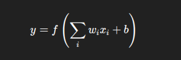
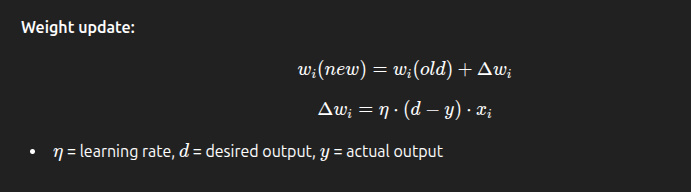

## 9.6 Neural Networks

### 1. Biological Neural Networks vs Artificial Neural Networks (ANN)

| Feature    | Biological Neural Network | Artificial Neural Network          |
| ---------- | ------------------------- | ---------------------------------- |
| Neurons    | Brain cells (biological)  | Artificial nodes (mathematical)    |
| Connection | Synapses                  | Weighted connections               |
| Learning   | Synaptic plasticity       | Adjusting weights using algorithms |
| Speed      | Slower                    | Fast computation                   |

**Key idea:** ANN mimics **structure and function** of brain neurons to solve problems.

---

### 2. McCulloch-Pitts Neuron

- **First mathematical model** of a neuron (1943)
- Inputs → Summation → Activation → Output
- Used for **binary classification** (0/1)

---

### 3. Mathematical Model of ANN

- **Neuron output:**

- (xi) = input, (wi) = weight, (b) = bias, (f) = activation function
- Key idea: Weighted sum + activation → output

---

### 4. Activation Functions

| Function    | Formula                     | Use                                 |
| ----------- | --------------------------- | ----------------------------------- |
| **Step**    | 1 if x>0, else 0            | Binary outputs                      |
| **Sigmoid** | 1 / (1+e^-x)                | Smooth output (0–1), differentiable |
| **Tanh**    | (e^x - e^-x) / (e^x + e^-x) | Output -1 to 1                      |
| **ReLU**    | max(0,x)                    | Avoids vanishing gradient           |

---

### 5. Architectures of Neural Networks

1. **Single-layer Perceptron** – One layer, simple classification
2. **Multi-layer Perceptron (MLP)** – Input layer + hidden layers + output layer, solves complex problems
3. **Feedforward** – Signals move forward only
4. **Recurrent** – Signals loop back, memory of past inputs

---

### 6. Perceptron

- Simple artificial neuron for **binary classification**
- **Learning rule:** Update weights if output ≠ desired output

**Weight update:**

---

### 7. Learning Rate & Gradient Descent

- **Learning rate ((\eta))**: Step size for weight updates
- **Gradient Descent:** Algorithm to **minimize error** (MSE) by adjusting weights

---

### 8. Delta Rule

- Used in **single-layer networks**
- Weight change proportional to **error × input × learning rate**
- Formula:

  

---

### 9. Hebbian Learning

- “Neurons that fire together, wire together”
- Strengthens connection between **co-activated neurons**
- Used in **unsupervised learning**

---

### 10. Adaline Network

- **Adaptive Linear Neuron**
- Uses **continuous output** and **MSE error**
- Weight updates via **gradient descent**

---

### 11. Multilayer Perceptron (MLP) & Backpropagation

- **MLP:** Input → Hidden → Output
- **Backpropagation:**

  1. Forward pass: compute output
  2. Compute error
  3. Backward pass: propagate error to adjust weights

- **Used for:** Complex classification, regression, image recognition

---

### 12. Hopfield Neural Network

- **Recurrent network**
- Stores **patterns as stable states**
- Can retrieve **complete pattern from partial input** (associative memory)

---

### Summary

1. ANN = Artificial neurons + weighted connections
2. McCulloch-Pitts = First neuron model, binary output
3. Activation functions: Step, Sigmoid, Tanh, ReLU
4. Perceptron = Single-layer, binary classification
5. MLP + Backprop = Multi-layer, supervised learning
6. Hebbian = Unsupervised, strengthen co-activated neurons
7. Adaline = Linear neuron with gradient descent
8. Hopfield = Recurrent network, associative memory

---

## MCQs

**1.** Artificial Neural Networks are inspired by: 
A) Decision Trees 
B) Human Brain 
C) Genetic Algorithms 
D) Naive Bayes

**Answer:** B) Human Brain

---

**2.** McCulloch-Pitts neuron is: 
A) Continuous output neuron 
B) First mathematical model of neuron 
C) Uses backpropagation 
D) Multi-layer network

**Answer:** B) First mathematical model of neuron

---

**3.** Which activation function outputs values between 0 and 1? 
A) Step 
B) Sigmoid 
C) Tanh 
D) ReLU

**Answer:** B) Sigmoid

---

**4.** Weight update in Perceptron depends on: 
A) Input only 
B) Error only 
C) Error × input × learning rate 
D) Activation function only

**Answer:** C) Error × input × learning rate

---

**5.** Which network is used for **associative memory**? 
A) Perceptron 
B) Adaline 
C) Hopfield 
D) MLP

**Answer:** C) Hopfield

---

**6.** Backpropagation is used in: 
A) Single-layer Perceptron 
B) Multi-layer Perceptron 
C) Hopfield Network 
D) Hebbian Learning

**Answer:** B) Multi-layer Perceptron

---

**7.** Hebbian learning is an example of: 
A) Supervised learning 
B) Unsupervised learning 
C) Reinforcement learning 
D) Statistical learning

**Answer:** B) Unsupervised learning

---

**8.** Adaline differs from Perceptron because it: 
A) Uses binary output 
B) Uses continuous output and gradient descent 
C) Is multi-layered 
D) Uses associative memory

**Answer:** B) Uses continuous output and gradient descent

---

**9.** ReLU activation function outputs: 
A) max(0, x) 
B) 1 / (1+e^-x) 
C) (e^x - e^-x)/(e^x + e^-x) 
D) 0 or 1 only

**Answer:** A) max(0, x)

---

**10.** Learning rate in neural networks controls: 
A) Activation function 
B) Step size in weight updates 
C) Number of hidden layers 
D) Type of network

**Answer:** B) Step size in weight updates
